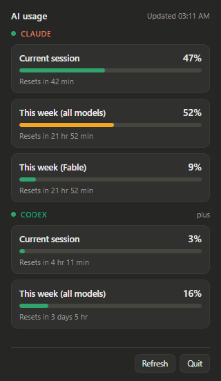

# AI Usage Tracker

A small tray app for **Windows and Linux** that shows how much of your **Claude** and **Codex**
usage limits you've used, without opening a browser.



If you use Claude Code or the Codex CLI on a subscription plan, you hit two
limits: a 5-hour session window and a weekly cap. This app keeps both in your
system tray, with a countdown to when each one resets.

## Features

- A tray icon that shows your current session usage as a percentage.
- Click it for a panel with every limit: current session, this week, and any
  per-model limits, each with a reset countdown.
- Claude and Codex side by side. It only shows the ones you're signed in to.
- No new login. It reuses the sign-in your Claude Code or Codex CLI already
  has on your machine.
- Optional start at login.
- Updates itself from GitHub Releases. You can turn this off.

## Requirements

- Windows 10 or 11, or a Linux desktop with a system tray (see
  [Linux](#linux)).
- At least one of:
  - [Claude Code](https://claude.com/claude-code), signed in with a Claude
    subscription (Pro or Max).
  - The [Codex CLI](https://github.com/openai/codex), signed in with your
    ChatGPT account (`codex login`).

Codex set up with an API key instead of a ChatGPT sign-in has no subscription
limits to show, and the app will say so.

## Install

1. Download `AI-Usage-Tracker-Setup-<version>.exe` from the
   [latest release](https://github.com/jefuriiij/ai-usage-tracker/releases/latest).
2. Run it. It installs for your user account only, so you don't need admin
   rights.
3. Windows will probably show a blue "Windows protected your PC" screen,
   because the installer isn't code-signed. Click **More info**, then
   **Run anyway**.

The app starts in your system tray. If you don't see it, check the hidden-icons
arrow (**^**) next to the clock and drag it onto the taskbar.

### Updates

From version 1.3.0, the app updates itself. It checks GitHub for a new version
30 seconds after it starts, then every 6 hours. A new version downloads in the
background. Then a notification and a **Restart to update** menu item appear.
Click either one to update now. If you do nothing, the update installs the next
time you quit. Your settings stay.

To turn this off, right-click the tray icon and untick **Update automatically**.

Version 1.2.0 and older can't update themselves. Install 1.3.0 or newer by hand
once, by running the newer installer over the old one.

### Linux

1. Download `AI-Usage-Tracker-<version>.AppImage` from the
   [latest release](https://github.com/jefuriiij/ai-usage-tracker/releases/latest).
2. Make it executable and run it:

   ```sh
   chmod +x AI-Usage-Tracker-<version>.AppImage
   ./AI-Usage-Tracker-<version>.AppImage
   ```

An update replaces the AppImage file with one that has the new version in its
name. **Start at login** follows the new file.

The Linux tray works a little differently from Windows:

- **Left-click opens the menu**, not the panel. Pick **Show usage panel** to
  open it.
- **There is no hover tooltip.** Instead, the menu starts with one line per
  provider, such as `Claude: 6% (2h 37m) · wk 58%`.
- **Start at login** writes `~/.config/autostart/ai-usage-tracker.desktop`.
  Un-ticking it deletes the file.
- The tray needs a StatusNotifierItem host. KDE Plasma, XFCE, Cinnamon and most
  other desktops have one. **GNOME needs the
  [AppIndicator extension](https://extensions.gnome.org/extension/615/appindicator-support/)**,
  or the icon won't appear.

## Using it

**Glance at the tray icon.** The number is your current session usage. If
you're signed in to both Claude and Codex, a coloured stripe along the bottom
tells you whose number it is: orange for Claude, green for Codex.

**Hover it** for a one-line summary per provider.

**Click it** to open the full panel. Bars turn amber at 50% and red at 85%.
Click a provider's name to open its usage page in your browser.

**Right-click it** for the menu:

| Item | What it does |
|------|--------------|
| Show usage panel | Opens the panel |
| Refresh now | Fetches fresh numbers straight away |
| Tray icon shows | With both providers signed in, pick *Highest usage*, *Claude* or *Codex* |
| Start at login | Launches the app when you sign in |
| Update automatically | Checks GitHub for new versions and installs them (on by default) |
| Restart to update to vX | Appears when an update is downloaded. Installs it now |
| Open Claude / Codex usage | Opens that provider's usage page |
| Quit | Closes the app |

The numbers refresh every 3 minutes.

## Privacy and safety

- The app reads the sign-in files your CLIs already keep
  (`~/.claude/.credentials.json` and `~/.codex/auth.json`). It never changes
  them and never renews a login itself.
- Your Claude login is only sent to Anthropic, and your Codex login only to
  OpenAI, to fetch your usage. Nothing goes anywhere else.
- To look for updates, the app downloads the release list from github.com. It
  sends no login, usage data or account details. Untick **Update automatically**
  and it never contacts GitHub.
- There's no account, no analytics and no telemetry.
- It keeps one settings file and a copy of the first usage response from each
  provider in `%APPDATA%\ai-usage-tracker\` (`~/.config/ai-usage-tracker/` on
  Linux). Uninstalling doesn't remove that
  folder, so delete it by hand if you want it gone.

## Troubleshooting

**The numbers look faded and say "as of" a time.**
Your CLI's sign-in has expired, usually because you haven't used it for a
while. The app never renews logins itself, so it shows your last known numbers
until you open Claude Code or Codex again. The next refresh picks it up.

**The icon shows `?`.**
There's no reading yet. Either the first refresh hasn't finished, the provider
you pinned in *Tray icon shows* hasn't reported in, or no signed-in Claude Code
or Codex CLI was found. Hover the icon to see which. If it says
"No AI CLI signed in", sign in to one of them and it appears on the next
refresh.

**A red banner says the request failed.**
Neither usage page is an official public API. If Anthropic or OpenAI change
theirs, that section will show an error until the app is updated. The other
provider keeps working.

**Refresh doesn't seem to do anything.**
Refreshes are limited to one every 30 seconds so the app doesn't get
rate-limited.

## Uninstall

Settings → Apps → Installed apps → **AI Usage Tracker** → Uninstall. Then
delete `%APPDATA%\ai-usage-tracker\` if you want your settings gone too.

On Linux, turn off **Start at login**, quit the app, and delete the AppImage.
Then delete `~/.config/ai-usage-tracker/` if you want your settings gone too.

## Disclaimer

This is an unofficial hobby project. It isn't affiliated with or endorsed by
Anthropic or OpenAI. Claude is a trademark of Anthropic; ChatGPT and Codex are
trademarks of OpenAI. The usage figures come from undocumented endpoints and
could stop working at any time.

## Contributing

Bug reports and pull requests are welcome. See
[docs/DEVELOPMENT.md](docs/DEVELOPMENT.md) for building from source, the
project layout, and how to add a new provider.
